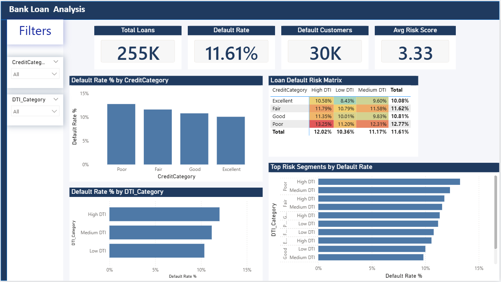

# Bank Loan Risk Analysis

This project analyzes bank loan default risk using **SQL Server** and **Power BI**.

## Tools Used
- SQL Server
- Power BI
- Kaggle Dataset

## Key Analysis
- Default Rate by Credit Category
- Default Rate by DTI Category
- Loan Default Risk Matrix
- Top Risk Segments

## Dashboard

## Insights

- Customers with **Poor credit score and High DTI** have the highest risk of default.
- Default rate decreases as credit score improves.
- High Debt-to-Income ratio significantly increases loan default probability.

